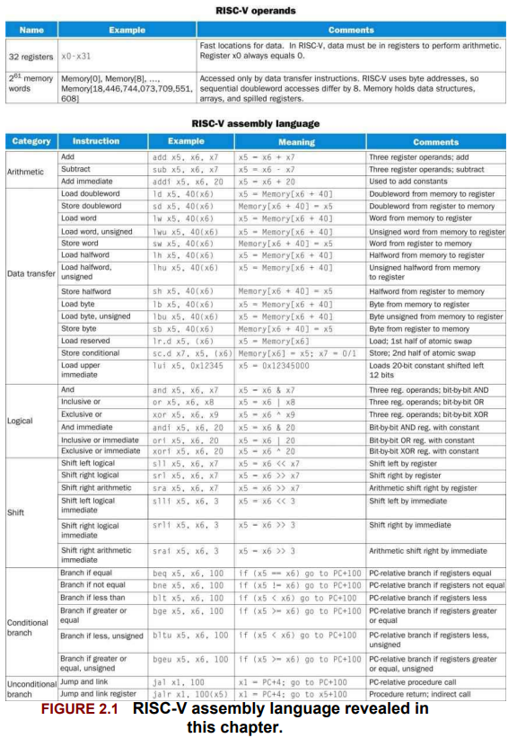

# Instructions - The Language of the Computer

**Instruction set** - The vocabulary of commands understood by a given architecture. Some popular ones are RISC-V, MIPS, x86.

**Stored-program concept** - The idea that instructions and data of many types can be stored in memory as numbers and thus be easy to change, leading to the stored-program computer. But what does this mean? 

```assembly
addi x5, x0, 10 # x5 = 10 
addi x6, x0, 20 # x6 = 20
add x7, x5, x6 # x7 = x5 + x6 = 30
```

After assembling, these become machine code — just numbers in memory:

|Address|Machine Code (Hex)|Instruction|
|---|---|---|
|0x0000|0x00A00293|`addi x5, x0, 10`|
|0x0004|0x01400313|`addi x6, x0, 20`|
|0x0008|0x006283B3|`add x7, x5, x6`|

These binary values are **just 32-bit numbers** — memory treats them the same as any other data.

### Now the fun part is:

Suppose you store the number `10` later in memory like this:

|Address|Data (binary or hex)|Meaning|
|---|---|---|
|0x0100|`0x0000000A`|Integer value `10`|

→ From memory’s perspective, there's **no difference** — both instructions and data are just 32-bit numbers stored at addresses.  
The CPU only knows which is **code** and which is **data** based on **how it accesses** them:

- **PC (program counter)** is used to **fetch instructions**
- **Load/store instructions** are used to fetch **data**

### And this is why:

- You can write **self-modifying code** (change your own instructions in memory — not common today but possible)
- Attackers can inject “data” that turns into executable instructions (hello, buffer overflows and shellcode )
- Systems need to **mark memory regions** as code vs data (`.text`, `.data`, executable permissions, etc.)

>[!IMPORTANT]
> Memory holds everything as numbers. Whether a number is **data** or an **instruction** depends entirely on **how the CPU uses it** — that’s the beauty (and danger) of the stored-program concept.



---

## Operations of the Computer 

RISC-V assembly language notation `add a, b, c` instructs the processor to add the two variables `b` and `c` and put their sum in `a`. But what if we want to add, let's say 4 variables(b, c, d, e)? 

```assembly
add a, b, c // The sum of b and c is placed in a 
add a, a, d // The sum of b, c, and d is now in a 
add a, a, e // The sum of b, c, d, and e is now in a 
```

The natural number of operands for an operation like addition is three: the two numbers being added together and a place to put the sum. Requiring every instruction to have exactly three operands, no more and no less, conforms to the philosophy of keeping the
hardware simple. This is where the first design principle comes into picture: **Simplicty favours regularity**. 

--- 

- Instructions are stored in memory as binary values (machine code), and fetched sequentially unless control instructions alter flow.
- The Instruction Set Architecture (ISA) defines the operations the hardware can execute.
- RISC-V uses fixed-length 32-bit instructions and a small, regular set of formats.

## RISC-V Instruction Formats

| Format | Fields | Example instruction |
|--------|--------|---------------------|
| R-type | opcode, rd, funct3, rs1, rs2, funct7 | `add x1, x2, x3` |
| I-type | opcode, rd, funct3, rs1, imm[11:0] | `addi x1, x2, 10` |
| S-type | opcode, imm[11:5], rs2, rs1, funct3, imm[4:0] | `sw x2, 0(x3)` |
| B-type | opcode, imm[12|10:5], rs2, rs1, funct3, imm[4:1|11] | `beq x1, x2, label` |
| U-type | opcode, rd, imm[31:12] | `lui x1, 0x10000` |
| J-type | opcode, rd, imm[20|10:1|11|19:12] | `jal x1, offset` |

## Instruction Types

- Arithmetic: `add`, `sub`, `addi`, etc.
- Logical: `and`, `or`, `xor`, `sll`, `srl`, etc.
- Memory access: `lw`, `sw`, etc.
- Control flow: `beq`, `bne`, `jal`, `jalr`
- Environment: `ecall`, `ebreak
## Procedures and Function Calls

- Use `jal` to jump to a procedure and store return address in a register (usually `x1`, aka `ra`).
- Use `jalr` to return (`jalr x0, x1, 0` or equivalent).
- Stack is managed manually using `sp` (x2) with `addi`, `sw`, `lw`.

### Example Procedure Call:
```assembly
addi sp, sp, -8
sw ra, 4(sp)
sw a0, 0(sp)
jal my_func
lw ra, 4(sp)
addi sp, sp, 8
```

## Immediate Encoding

- Immediates are sign-extended.
- Not all immediates are in the same bit positions (especially in S- and B-type).
- Compiler often uses pseudo-instructions for clarity (`li`, `mv`, etc.).


## Assembler, Compiler, Linker

- Compiler: high-level language → assembly
- Assembler: assembly → machine code
- Linker: resolves addresses between multiple files

## Register File Conventions

| Name | Number | Usage           |
|------|--------|------------------|
| x0   | zero   | Always 0         |
| x1   | ra     | Return address   |
| x2   | sp     | Stack pointer    |
| x5–x7 | t0–t2  | Temporary        |
| x10–x17 | a0–a7 | Function args / return values |
| x8–x9, x18–x27 | s0–s11 | Saved registers |

## Instruction Encoding Fields

- R-type: `[ funct7 | rs2 | rs1 | funct3 | rd | opcode ]`
- I-type: `[ imm[11:0] | rs1 | funct3 | rd | opcode ]`
- S-type: `[ imm[11:5] | rs2 | rs1 | funct3 | imm[4:0] | opcode ]`

## Example: C to RISC-V

```c
int sum(int a, int b) {
    return a + b;
}
```

```assembly 
sum:
    add a0, a0, a1
    ret 
```


