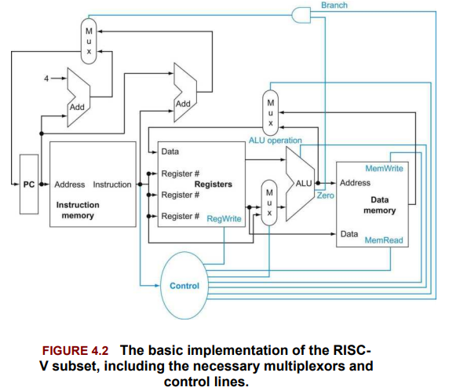
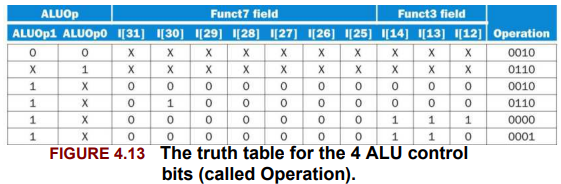

# Processor Design 

The performance of a computer is determined by three key factors: instruction count, clock cycle time, and clock cycles per instruction (CPI). 

## RISC-V Implementation 

How is an instruction set like RV32I actually implemented? Questions like "How does this work?", "Is there a better way to implement this design?", and "Can these ideas apply to other architectures?" are all valid and important.
To answer them, we explore how an ISA is translated into hardware and understand these core concepts. 

- The ISA isn’t just an abstract spec — it directly influences how you design the hardware, affecting things like datapath complexity, control logic, and ultimately performance parameters such as clock rate and CPI(Clock Cycle per Instruction).
- The classic design principles — like simplicity favors regularity, smaller is faster, and make the common case fast — aren’t just academic ideas. They’re practical rules of thumb that guide real-world processor design.
- Good processor design is always about balancing trade-offs—you can’t optimize everything at once. These compromises shape both academic designs and industrial-level chips, from embedded controllers all the way up to high-performance CPUs.
- The approach and ideas you learn here form the foundation for designing processors across the whole industry, whether it’s a tiny MCU or a big server CPU.

---

## RISC-V Instruction Execution and Datapath Overview

This section outlines how a basic RISC-V processor executes instructions, focusing on datapath design, control flow, and common patterns across instruction types. The goal is to understand how data flows through the system and how control signals steer the execution.

### Common Steps in Instruction Execution

For every RISC-V instruction, the first two steps are **always the same**:

1. **Instruction Fetch**
    
    - The **Program Counter (PC)** is used to fetch the next instruction from instruction memory.
        
    - Example:  
        If `PC = 0x00000004`, the processor loads the instruction at address `0x00000004`.
        
2. **Register Read**
    
    - The processor reads **one or two registers** based on the instruction type.
        
    - Example:
        
        - For `add x3, x1, x2`, both `x1` and `x2` are read.
            
        - For `lw x5, 0(x1)`, only `x1` is read (for address calculation).
            

### Instruction Class Behavior

After the first two steps, behavior diverges based on **instruction class**. However, all instructions **use the ALU** in some form:

- **Memory Instructions (e.g., `lw`, `sw`)**
    
    - ALU computes effective memory address.
        
    - For `lw`, memory is read.
        
    - For `sw`, memory is written.
        
- **Arithmetic-Logical Instructions (e.g., `add`, `sub`, `and`)**
    
    - ALU performs the required operation.
        
    - The result is written to the destination register.
        
- **Branch Instructions (e.g., `beq`, `bne`)**
    
    - ALU performs a comparison (e.g., subtraction to check equality).
        
    - If the condition is true, the PC is updated to the branch target.
        

#### Example 1: `add x3, x1, x2`

- Fetch instruction at `PC`
    
- Read `x1` and `x2`
    
- ALU computes `x1 + x2`
    
- Write result to `x3`
    
- PC ← PC + 4
    

### Example 2: `lw x5, 8(x1)`

- Fetch instruction at `PC`
    
- Read `x1`
    
- ALU computes effective address: `x1 + 8`
    
- Load memory at that address
    
- Write loaded value to `x5`
    
- PC ← PC + 4
    

### Example 3: `beq x1, x2, offset`

- Fetch instruction at `PC`
    
- Read `x1` and `x2`
    
- ALU checks if `x1 == x2`
    
- If true: PC ← PC + offset
    
- If false: PC ← PC + 4
    

---

### Multiplexers and Control Logic

Because different instruction types reuse datapath components (e.g., ALU, memory, PC update), **multiplexers (MUXes)** are required to select the correct inputs/outputs. These are controlled by **control signals**, which are derived from the instruction itself.

**Examples:**

- PC can be updated with `PC + 4` (next instruction) or `PC + offset` (branch).
    
- ALU second input can be either a register value or an immediate constant.
    
- Register write data can come from the ALU (arithmetic) or memory (load).
    

### Control Signals

Key functional units (like the ALU, memory, and register file) behave differently depending on the instruction. The **Control Unit** decodes the instruction and generates the appropriate signals:

- ALU operation type (`add`, `sub`, etc.)
    
- Whether to read/write memory
    
- Whether to write to a register
    
- MUX select lines

---

**Datapath element** - A unit used to operate on or hold data within a processor. In the RISC-V implementation, the datapath elements include the instruction and data memories, the register file, the ALU, and adders.

**Program Counter** - The register containing the address of the instruction in the program being executed.

---

## RISC-V Instruction Execution: Datapath & Control 

This section elaborates the **internal mechanics** of instruction execution in a simple RISC-V processor design.

### 1. **Instruction Fetch & PC Update**

- The **Program Counter (PC)** holds the address of the current instruction.
    
- Instructions are fetched from **instruction memory** using the PC.
    
- After fetching, the PC is incremented by **4 bytes** to point to the next instruction.
    

> RISC-V is **byte-addressable** and has fixed 32-bit (4-byte) instructions in the base ISA, hence `PC ← PC + 4`.

### 2. **R-Type (Arithmetic-Logical) Instructions**

- Example: `add x1, x2, x3`
    
    - Reads values from registers `x2` and `x3`
        
    - Performs ALU operation (`x2 + x3`)
        
    - Writes result into `x1`
        
- Components involved:
    
    - **Register file**: 32 general-purpose registers, each 64 bits wide in RV64
        
    - **ALU**: Executes arithmetic or logical operation
        
    - **Control unit**: Sets the ALU operation and write enable signals
        

> Each register has a 5-bit address (since 2⁵ = 32 registers)

### 3. **Load/Store Instructions**

- Format: `ld x1, offset(x2)` or `sd x1, offset(x2)`
    
    - Address is calculated by `x2 + sign-extended offset`
        
    - For `ld`, memory is **read** into `x1`
        
    - For `sd`, memory is **written** with value from `x1`
        
- Components added:
    
    - **Sign-extender**: Converts 12-bit offset to 64-bit signed value
        
    - **Data memory**: Supports read/write with separate control signals
        

### 4. **Branch Instructions**

- Example: `beq x1, x2, offset`
    
    - Compares `x1 == x2` using ALU
        
    - If true (Zero output = 1):  
        `PC ← PC + (offset << 1)`
        
    - If false:  
        `PC ← PC + 4`
        
- Extra logic:
    
    - **Adder**: Computes branch target as `PC + offset`
        
    - **Shift left 1**: Because RISC-V branch offsets are multiples of 2 (half-word aligned)
        
    - **Control logic**: Decides between branch target and sequential next PC
        

### 5. **Multiplexers & Control Lines**

- Since various instruction types reuse datapath components, we use **multiplexers** to select inputs/outputs dynamically.
    
- Control unit decodes the instruction and sets:
    
    - ALU operation
        
    - Memory read/write enable
        
    - Register write enable
        
    - MUX select lines for PC, ALU inputs, and register file write data

---

## ALU Control: How the ALU Executes Instructions

### Overview

This section explains how the ALU in a RISC-V processor determines which operation (add, sub, and, or) to perform, depending on the **type of instruction** being executed.

At a high level:

> The instruction's **opcode**, along with its `funct3` and `funct7` fields (for R-type), determines the **control signals** that tell the ALU what operation to execute.

### Key ALU Operations and Control Bits

The RISC-V ALU recognizes these four primary operations:

|ALU Control (4-bit)|Operation|
|---|---|
|0000|AND|
|0001|OR|
|0010|ADD|
|0110|SUBTRACT|

These control bits are **not** directly encoded in the instruction. Instead, they are **generated** through a two-step decoding process.

### ALUOp: First-Level Control

A 2-bit control signal called `ALUOp` comes from the **main control unit**. It provides a coarse indication of what kind of ALU operation is needed:

|ALUOp|Purpose|Used For Instructions|
|---|---|---|
|00|Always perform **ADD**|`lw`, `sw` (address calc)|
|01|Always perform **SUBTRACT**|`beq` (equality check)|
|10|Use `funct3`/`funct7` fields|R-type instructions like `add`, `sub`, `and`, `or`|

### ALU Control Unit: Second-Level Decoder

- Takes `ALUOp`, `funct3`, and `funct7` as inputs.
    
- Outputs a 4-bit **ALU control signal** to specify the actual ALU operation.
    
- Uses a **truth table** to implement this logic.
    
- For `ALUOp = 10`, it uses bits from `funct3` (bits 14–12) and `funct7` (bit 30) to differentiate instructions like `add` vs `sub`.
    

Example logic:

- `funct3 = 000`, `funct7 = 0000000` → `add`
    
- `funct3 = 000`, `funct7 = 0100000` → `sub`
    
- `funct3 = 111` → `and`
    
- `funct3 = 110` → `or`
    
### Optimization Techniques

- Only a **subset** of all possible `funct` values is relevant — unused values are ignored.
    
- The control logic is often **simplified** using **don't-care bits (`X`)** to reduce gate complexity.
    
- This leads to **faster and smaller** control logic.

---

## Control Signal Generation from the Instruction Format

### Instruction Format Overview

Each RISC-V instruction is encoded with specific fields. Understanding the **bit positions** of these fields is crucial for generating the correct control signals.

|Field|Bits|Description|
|---|---|---|
|`opcode`|6:0|Specifies the instruction type and format|
|`rd`|11:7|Destination register (for R-type and load)|
|`funct3`|14:12|Helps specify the operation along with `funct7`|
|`rs1`|19:15|First source register|
|`rs2`|24:20|Second source register (R-type, store, branch)|
|`funct7`|31:25|Extended opcode field for R-type|

**Design principle applied:**

> _Simplicity favors regularity_ — same field positions across instruction types helps in easier control logic.

### Control Signals in the Datapath

The simple datapath uses 8 main control signals:

|Control Signal|Description|
|---|---|
|`RegWrite`|Enables writing to register file (used in R-type, load)|
|`MemRead`|Enables memory read (used in `lw`)|
|`MemWrite`|Enables memory write (used in `sw`)|
|`ALUSrc`|Selects 2nd ALU operand (register vs immediate)|
|`MemToReg`|Selects write-back source (from memory or ALU)|
|`Branch`|Indicates if instruction is a conditional branch|
|`ALUOp[1:0]`|2-bit signal passed to ALU control unit for determining ALU action|
|`PCSrc`|Selects PC update source: `PC+4` or branch target address|

> `PCSrc = Branch AND Zero`  
> (Zero is the output from the ALU indicating `rs1 == rs2` for `beq`)

### Control Signal Table (Informal Mapping by Opcode)

This is a functional mapping — for each instruction type (based on opcode), the control unit sets these 8 signals appropriately.

|Instruction Type|RegWrite|ALUSrc|MemToReg|MemRead|MemWrite|Branch|ALUOp|
|---|---|---|---|---|---|---|---|
|R-type (e.g. add, sub)|1|0|0|0|0|0|10|
|Load (`lw`)|1|1|1|1|0|0|00|
|Store (`sw`)|0|1|X|0|1|0|00|
|Branch (`beq`)|0|0|X|0|0|1|01|

- `X` denotes "don't care" — signal isn't used in that instruction type.

### How PCSrc Is Determined

To change the PC for a branch:

`PCSrc = Branch AND Zero`

- `Branch`: Set by the control unit if the instruction is `beq`
- `Zero`: Output from ALU when `rs1 - rs2 == 0`

Only if both are true does the PC jump to the **branch target address**.

### Final Notes

- The **main control unit** uses the `opcode` to set all control lines except `PCSrc`.
    
- ALU behavior is determined in two steps:
    
    1. Main control sets `ALUOp`
        
    2. ALU control unit decodes `funct7`, `funct3` and `ALUOp` to drive the ALU

---

## Limitations of the Single-Cycle Processor Design

### Why Doesn't a Single-Cycle Processor Scale?

A **single-cycle processor** executes each instruction in exactly **one clock cycle**. While this is simple and functionally correct, it is highly inefficient for real-world usage.

### Problem: The Clock Cycle is Determined by the Longest Instruction

- All instructions share the same clock cycle length.
    
- The **longest path** through the datapath dictates the **minimum clock cycle time**.
    
- For example, a `load` instruction typically takes the most time because it uses:
    
    1. Instruction memory (fetch)
        
    2. Register file (read)
        
    3. ALU (address computation)
        
    4. Data memory (read)
        
    5. Register file (write back)
        

This means even fast instructions like `add` or `sub` must wait through a longer-than-necessary clock cycle.

### Result: Wasted Performance

- Even though CPI (cycles per instruction) is 1, the **clock cycle time is too long**, making the overall performance poor.
    
- Reducing the delay of common instructions is **useless** in this model if it doesn't also reduce the longest-case delay.
    

This violates a key design principle:

> Make the common case fast.

### Historical Note

- Early computers with very simple ISAs did use single-cycle implementations.
    
- However, this design becomes impractical when dealing with:
    
    - Complex ISAs
        
    - Multi-cycle operations (e.g., floating point)
        
    - Power or area constraints

